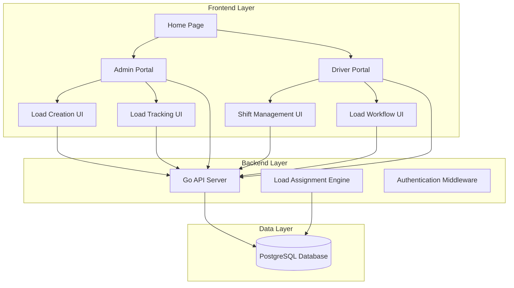

# Design Document

## Overview

The Vorto Logistics Scheduler is a full-stack web application built with a Go backend API, Vue.js 3 + TypeScript frontend, and PostgreSQL database. The system features two distinct user interfaces (Admin and Driver portals) with real-time load assignment and tracking capabilities. The architecture emphasizes efficient load dispatching algorithms, persistent session management, and responsive map-based interfaces.

## Architecture

### System Architecture



### Technology Stack

- **Frontend**: Vue.js 3 with TypeScript, TailwindCSS, Leaflet.js for maps
- **Backend**: Go with Gin framework, REST API
- **Database**: PostgreSQL with spatial extensions (PostGIS)
- **Session Management**: Local storage with username-based tracking
- **Maps**: OpenStreetMap with Leaflet.js
- **Build Tools**: Vite for frontend, Go modules for backend
- **Containerization**: Docker and Docker Compose

## Components and Interfaces

### Frontend Components

#### Home Page Component
- **Purpose**: Role selection interface
- **Features**: Simple two-button layout (Admin/Driver)
- **Navigation**: Routes to respective login pages

#### Admin Portal Components
1. **AdminLogin**: Username-based authentication
2. **LoadCreation**: Map interface for creating loads
   - Interactive map with click-to-select locations
   - Form for load details
   - Real-time validation
3. **LoadTracking**: Dashboard for monitoring all loads
   - Filterable load list
   - Status indicators
   - Manual refresh for updates

#### Driver Portal Components
1. **DriverLogin**: Username-based authentication with driver creation
2. **ShiftManagement**: Shift control interface
   - Start/end shift buttons
   - Location input (map or manual lat/lng)
   - Current status display
3. **LoadWorkflow**: Load assignment and completion interface
   - Load assignment notifications
   - Accept/reject buttons
   - Map view with pickup/dropoff locations
   - Pickup/dropoff action buttons

### Backend API Endpoints

#### Authentication Endpoints
```
POST /api/admin/login    # Simple username validation
POST /api/driver/login   # Username validation with driver creation
```

#### Admin Endpoints
```
POST /api/admin/loads          # Create new load
GET  /api/admin/loads          # Get all loads with status
GET  /api/admin/loads/:id      # Get specific load details
```

#### Driver Endpoints
```
POST /api/driver/shift/start   # Start shift with location
POST /api/driver/shift/end     # End current shift
GET  /api/driver/status        # Get current driver status
POST /api/driver/load/accept   # Accept assigned load
POST /api/driver/load/reject   # Reject assigned load
POST /api/driver/load/pickup   # Complete pickup
POST /api/driver/load/dropoff  # Complete dropoff
```


## Data Models

### Database Schema

#### Users Table
```sql
CREATE TABLE users (
    id SERIAL PRIMARY KEY,
    username VARCHAR(255) UNIQUE NOT NULL,
    role VARCHAR(50) NOT NULL CHECK (role IN ('admin', 'driver')),
    created_at TIMESTAMP DEFAULT CURRENT_TIMESTAMP,
    updated_at TIMESTAMP DEFAULT CURRENT_TIMESTAMP
);
```

#### Drivers Table
```sql
CREATE TABLE drivers (
    id SERIAL PRIMARY KEY,
    user_id INTEGER REFERENCES users(id),
    current_latitude DECIMAL(10, 8),
    current_longitude DECIMAL(11, 8),
    is_on_shift BOOLEAN DEFAULT FALSE,
    shift_started_at TIMESTAMP,
    created_at TIMESTAMP DEFAULT CURRENT_TIMESTAMP,
    updated_at TIMESTAMP DEFAULT CURRENT_TIMESTAMP
);
```

#### Loads Table
```sql
CREATE TABLE loads (
    id SERIAL PRIMARY KEY,
    pickup_latitude DECIMAL(10, 8) NOT NULL,
    pickup_longitude DECIMAL(11, 8) NOT NULL,
    dropoff_latitude DECIMAL(10, 8) NOT NULL,
    dropoff_longitude DECIMAL(11, 8) NOT NULL,
    status VARCHAR(50) NOT NULL DEFAULT 'awaiting_driver' 
        CHECK (status IN ('awaiting_driver', 'in_progress', 'completed')),
    driver_status VARCHAR(50) NOT NULL DEFAULT 'unassigned'
        CHECK (driver_status IN ('unassigned', 'assigned', 'accepted', 'pickedup', 'droppedoff')),
    assigned_driver_id INTEGER REFERENCES drivers(id),
    created_by INTEGER REFERENCES users(id),
    pickup_completed_at TIMESTAMP,
    dropoff_completed_at TIMESTAMP,
    created_at TIMESTAMP DEFAULT CURRENT_TIMESTAMP,
    updated_at TIMESTAMP DEFAULT CURRENT_TIMESTAMP
);
```


### Go Data Structures

```go
type User struct {
    ID        uint      `json:"id" gorm:"primaryKey"`
    Username  string    `json:"username" gorm:"unique;not null"`
    Role      string    `json:"role" gorm:"not null"`
    CreatedAt time.Time `json:"created_at"`
    UpdatedAt time.Time `json:"updated_at"`
}

type Driver struct {
    ID               uint     `json:"id" gorm:"primaryKey"`
    UserID           uint     `json:"user_id"`
    User             User     `json:"user" gorm:"foreignKey:UserID"`
    CurrentLatitude  *float64 `json:"current_latitude"`
    CurrentLongitude *float64 `json:"current_longitude"`
    IsOnShift        bool     `json:"is_on_shift" gorm:"default:false"`
    ShiftStartedAt   *time.Time `json:"shift_started_at"`
    CreatedAt        time.Time `json:"created_at"`
    UpdatedAt        time.Time `json:"updated_at"`
}

type Load struct {
    ID                  uint      `json:"id" gorm:"primaryKey"`
    PickupLatitude      float64   `json:"pickup_latitude"`
    PickupLongitude     float64   `json:"pickup_longitude"`
    DropoffLatitude     float64   `json:"dropoff_latitude"`
    DropoffLongitude    float64   `json:"dropoff_longitude"`
    Status              string    `json:"status" gorm:"default:awaiting_driver"`
    DriverStatus        string    `json:"driver_status" gorm:"default:unassigned"`
    AssignedDriverID    *uint     `json:"assigned_driver_id"`
    AssignedDriver      *Driver   `json:"assigned_driver,omitempty" gorm:"foreignKey:AssignedDriverID"`
    CreatedBy           uint      `json:"created_by"`
    Creator             User      `json:"creator" gorm:"foreignKey:CreatedBy"`
    PickupCompletedAt   *time.Time `json:"pickup_completed_at"`
    DropoffCompletedAt  *time.Time `json:"dropoff_completed_at"`
    CreatedAt           time.Time `json:"created_at"`
    UpdatedAt           time.Time `json:"updated_at"`
}
```

## Error Handling

### Frontend Error Handling
- **Network Errors**: Retry mechanism with exponential backoff
- **Validation Errors**: Real-time form validation with user-friendly messages
- **Authentication Errors**: Automatic redirect to login with error message
- **API Errors**: User-friendly error messages with refresh suggestions

### Backend Error Handling
- **Database Errors**: Proper error logging and generic user messages
- **Validation Errors**: Structured error responses with field-specific messages
- **Authentication Errors**: Consistent 401/403 responses
- **Load Assignment Errors**: Fallback mechanisms and error logging

### Error Response Format
```go
type ErrorResponse struct {
    Error   string            `json:"error"`
    Message string            `json:"message"`
    Fields  map[string]string `json:"fields,omitempty"`
    Code    int               `json:"code"`
}
```

## Session Management

### Frontend Session Handling
- **Local Storage**: Store username after successful login
- **Request Headers**: Send username with every API request via `X-Username` header
- **Session Persistence**: Maintain session across browser refreshes and tabs
- **Logout**: Clear local storage and redirect to home page

### Backend Session Validation
- **Username Extraction**: Read `X-Username` header from requests
- **User Lookup**: Validate username exists in database
- **Driver State**: Restore driver shift and load state based on username
- **No Server-side Sessions**: Stateless authentication using username only

## Load Assignment Algorithm

### Distance Calculation
```go
func calculateDistance(lat1, lon1, lat2, lon2 float64) float64 {
    // Haversine formula for great-circle distance
    const R = 6371 // Earth's radius in kilometers
    
    dLat := (lat2 - lat1) * math.Pi / 180
    dLon := (lon2 - lon1) * math.Pi / 180
    
    a := math.Sin(dLat/2)*math.Sin(dLat/2) +
         math.Cos(lat1*math.Pi/180)*math.Cos(lat2*math.Pi/180)*
         math.Sin(dLon/2)*math.Sin(dLon/2)
    
    c := 2 * math.Atan2(math.Sqrt(a), math.Sqrt(1-a))
    
    return R * c
}
```

### Assignment Logic
1. **Find Available Drivers**: Query all drivers currently on shift without assigned loads
2. **Calculate Distances**: Compute distance from each driver to pickup location
3. **Optimize Assignment**: Select driver that minimizes total driven miles
4. **Handle Edge Cases**: Queue loads when no drivers available, reassign on rejection

### Data Updates
- **Manual Refresh**: Users refresh pages to get latest data from server
- **Status Polling**: Optional periodic API calls for status updates
- **Optimistic Updates**: UI updates immediately with API confirmation